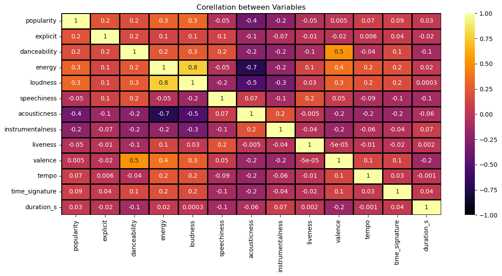
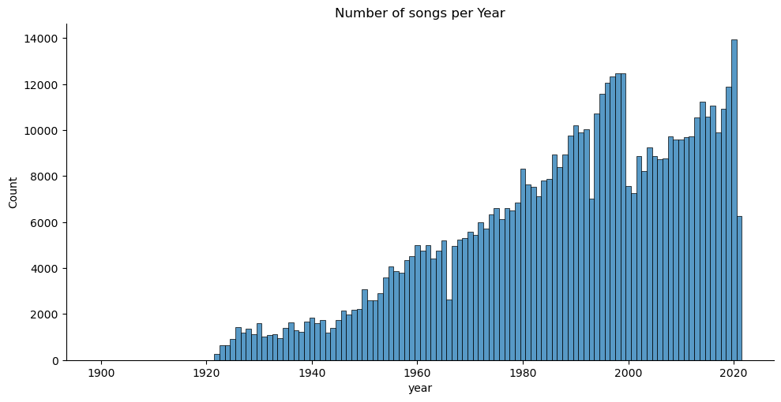
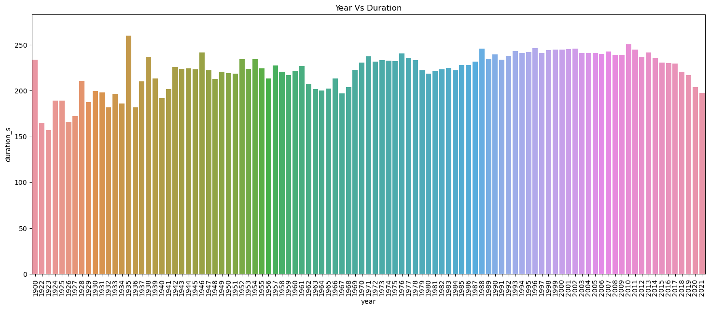
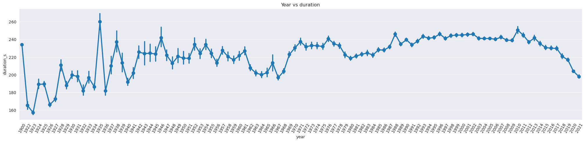

# spotify_eda
## Exploratory Data Analysis of Spotify Data 
Datasets from: https://www.kaggle.com/datasets/lehaknarnauli/spotify-datasets

### Brief Introduction
Spotify is one of the largest streaming platforms in the world, with over 456 million monthly active users and 195 million paying subscribers as of September 20222. The company was founded on 23 April 2006 by Daniel Ek and Martin Lorentzon.

### The aim of this project is to analyse the spotify data gotten from the links shared above
My analysis will be focused on the following:
1. What are the ten least Popular songs
2. What are the ten most Popular songs 
3. What is the correlation between the variables in the dataframe 
4. Has there been an increase or decrease in the number of songs produced over time
5. How has the duration of songs changed over time

### From the analysis carried out i was able to gain this insights 

#### The ten least popular songs on in the dataset are: 
- You and the night and the music by Libby Holman & Her Orchestra
- Roses of Picardy by Paul Specht
- I'm the last of the red hot mamas by Sophie Tucker
- Snakes hips by The Georgians
- The man I love by Sophie Tucker and Miff Mole
- I'll Have Vanilla by Eddie Cantor
- Little Curly Hair In a High Chair by Jerry Joyce, Eddie Cantor
- The Grass Grows Greener by Paul Specht
- Savannah by The Georgians
- Barney google by The Georgians

#### The ten most popular songs in the dataset are:
- Peaches (feat. Daniel Caesar & Giveon) by Justin Bieber, Daniel Caesar and Giveon
- Drivers license by Olivia Rodrigo
- Save your tears by The Weekend
- Telepatia by Kali Uchis
- Blindig Lights by The Weekend
- Leave the Door open by Bruno Mars, Anderson. Paak and Silk Sonic
- Streets by Doja Cat
- Heartbreak Anniversary by Giveon

##### Corellation of the Variables in the dataset
Most of the variables in the dataset were loosely correlated, the highest positive corellation was observed between energy and loudness with a corr of 0.8 followed by danceability and valance at 0.5, the highest negative corellation was observed between energy and acousticness with a corr of -0.7 followed by loudness and acousticness at -0.5

##### The amount of songs produced per has has increased over time with the highest peak observed in 2020.

##### Song duration has dropped over time, songs have gotten shorter as shown in the graph below

